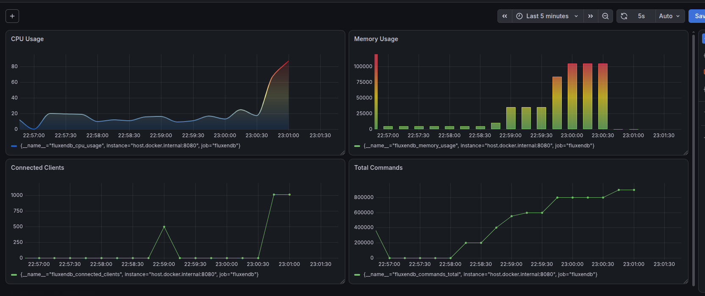

# FluxenDB — Performance Results: Current Architecture

Benchmarks were run using the standard `redis-benchmark` tool against the current FluxenDB server.

**Command used:**
```bash
redis-benchmark -t set,get -c <# clients>
```

---

## Results by Concurrency Level

### -c 10 (10 clients)

| Metric | Value |
|--------|-------|
| **Throughput** | 126,903.55 req/sec |

| avg | min | p50 | p95 | p99 | max |
|-----|-----|-----|-----|-----|-----|
| 0.048 ms | 0.016 ms | 0.047 ms | 0.055 ms | 0.111 ms | 2.503 ms |

---

### -c 100 (100 clients)

| Metric | Value |
|--------|-------|
| **Throughput** | 93,984.96 req/sec |

| avg | min | p50 | p95 | p99 | max |
|-----|-----|-----|-----|-----|-----|
| 0.548 ms | 0.128 ms | 0.447 ms | 0.983 ms | 2.103 ms | 14.319 ms |

---

### -c 500 (500 clients)

| Metric | Value |
|--------|-------|
| **Throughput** | 99,601.60 req/sec |

| avg | min | p50 | p95 | p99 | max |
|-----|-----|-----|-----|-----|-----|
| 2.535 ms | 0.136 ms | 2.479 ms | 3.479 ms | 5.087 ms | 24.591 ms |

---

### -c 1000 (1000 clients)

| Metric | Value |
|--------|-------|
| **Throughput** | 87,950.75 req/sec |

| avg | min | p50 | p95 | p99 | max |
|-----|-----|-----|-----|-----|-----|
| 5.723 ms | 0.272 ms | 5.607 ms | 8.135 ms | 11.103 ms | 37.695 ms |

---

### -c 5000 (5000 clients) — ⚠️ Hard Limit Reached

```
WARNING: Could not fetch server CONFIG
^C T: rps=0.0 (overall: 555.3) avg_msec=-nan (overall: 36.606)
```

The benchmark was manually interrupted (`^C`) after the server became unable to sustain meaningful throughput. At 5000 concurrent clients, the thread-per-client model exhausted available system resources — the server stalled at ~555 req/sec overall with latency becoming unmeasurable (`-nan`). This is the hard concurrency ceiling of the current architecture.

---

## Throughput Summary

| Clients | Throughput (req/sec) | Avg Latency | p99 Latency | Notes |
|---------|----------------------|-------------|-------------|-------|
| 10      | 126,903.55           | 0.048 ms    | 0.111 ms    |       |
| 100     | 93,984.96            | 0.548 ms    | 2.103 ms    |       |
| 500     | 99,601.60            | 2.535 ms    | 5.087 ms    |       |
| 1000    | 87,950.75            | 5.723 ms    | 11.103 ms   |       |
| 5000    | ~555 (collapsed)     | N/A         | N/A         | ⚠️ Server stalled, benchmark manually killed |

---

## Observations

- Peak throughput is achieved at low concurrency (**~127K req/sec at 10 clients**), where lock contention on the single `db_mutex` is minimal.
- Throughput drops as concurrency increases due to the current **single-mutex architecture** serializing all reads and writes.
- Latency grows proportionally with client count, reaching **~5.7 ms avg and ~11 ms p99 at 1000 clients**.
- The current architecture uses one `std::thread` per client and one global `std::mutex`, which is the primary bottleneck under high concurrency.
- At **5000 clients**, the server fully collapsed — throughput fell to ~555 req/sec and latency became unmeasurable. This marks the hard ceiling of the thread-per-client model.

---

## Benchmark Graph 

Observed after last test case

<!-- Add graph image to this folder and update the path below -->

